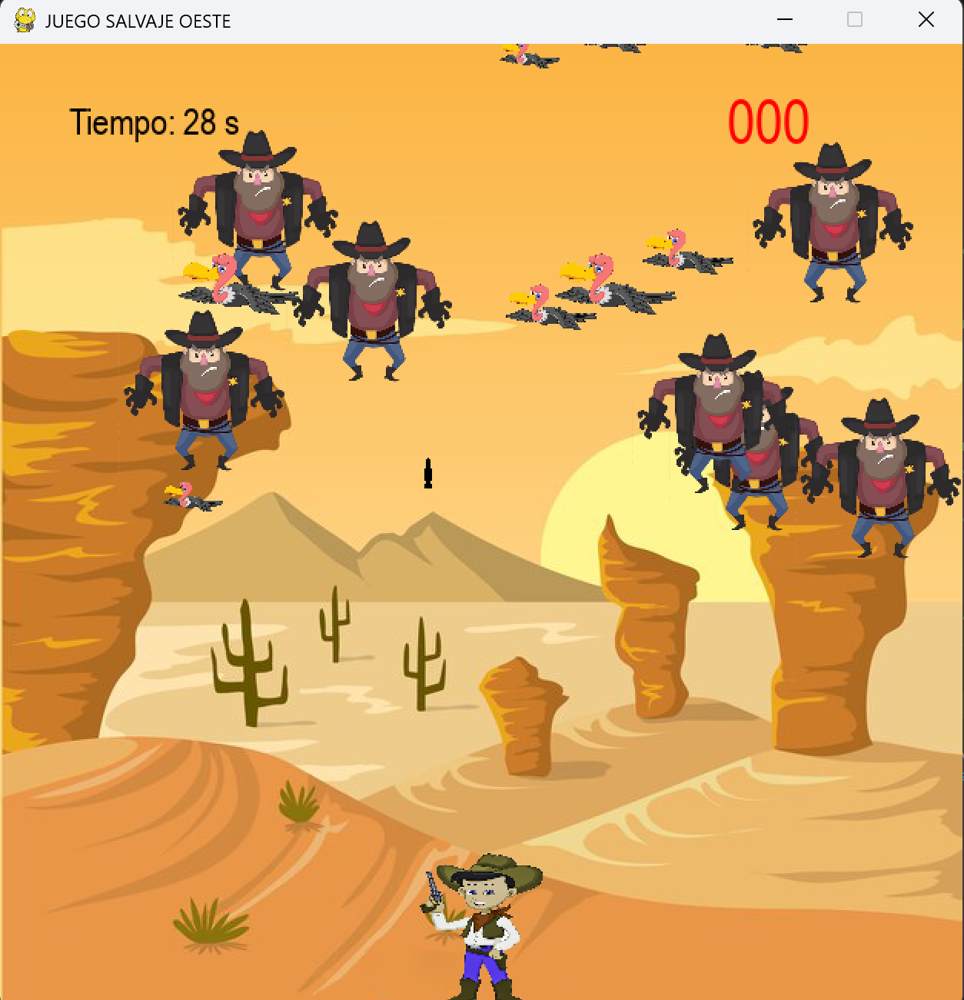

# Salvaje Oeste

Proyecto final de la asignatura **Programación** – 1er curso del Grado en Ingeniería Matemática e Inteligencia Artificial (ICAI).

Un juego desarrollado en **Python** con la librería `pygame` donde encarnas a un sheriff que debe defender el pueblo del Salvaje Oeste de una invasión de villanos… y esquivar molestos buitres.

---

## Descripción

Tienes **30 segundos** para eliminar tantos villanos como puedas y conseguir la máxima puntuación.  
- **Villanos**: aumentan tu puntuación si los eliminas.  
- **Buitres**: no suman puntos, pero si chocan contigo… adiós partida.  

La dificultad aumenta con el tiempo ya que cada **5 segundos** se generan nuevos enemigos de forma aleatoria.

---

## Controles

- **`D`** → Mover a la derecha  
- **`A`** → Mover a la izquierda  
- **`W`** → Mover hacia arriba (hasta la mitad de la pantalla)  
- **`S`** → Mover hacia abajo  
- **`SPACE`** → Disparar (un disparo cada 0.5 segundos)  

---
## Capturas del juego




## Dinámica del juego

- El sheriff comienza en el centro inferior de la pantalla.  
- Villanos aparecen en posiciones aleatorias de la mitad superior.  
- Buitres salen desde arriba y vuelven a aparecer tras llegar abajo.  
- Tiempos, tamaños y velocidades de enemigos son aleatorios en rangos predefinidos.  
- Cuenta regresiva de **30 segundos** visible en la esquina superior izquierda.  
- Puntuación actual en la esquina superior derecha.

---

## Estructura del proyecto

- **430 líneas de código**
- **11 funciones**
- **4 clases**
- **4 ficheros de datos**
- **Librerías usadas**:
  - `pygame`
  - `random`
  - `os`
  - `time`

---

## Elementos especiales

- Música del Salvaje Oeste durante la partida.  
- Efecto de sonido al disparar.  
- Sonido especial al eliminar buitres.  
- Música de *game over* o *victoria* según el resultado.  

---

## Condiciones de fin de partida

- **Colisión** con villano o buitre → *Game Over*.
- **Villano alcanza el borde inferior** → *Game Over*.
- **Sobrevivir los 30 segundos** → *Victoria* con puntuación final.

Para reiniciar: **pulsar Enter**.

---

## Ejecución

1. Clonar este repositorio:
   ```bash
   git clone https://github.com/tu_usuario/salvaje-oeste.git
   cd salvaje-oeste
